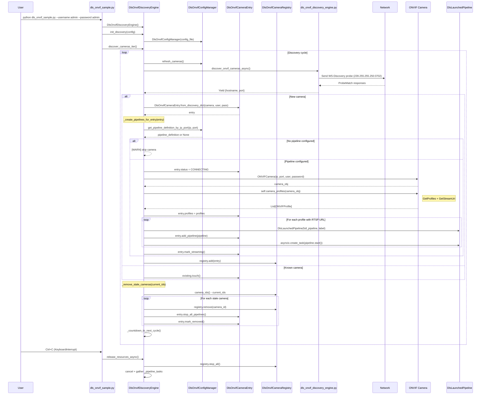

# ONVIF Camera Discovery Sample

## Table of Contents
1. [Overview](#overview)
2. [What Is Included](#what-is-included)
3. [Prerequisites](#prerequisites)
4. [How It Works](#how-it-works)
5. [Configuration](#configuration)
6. [Running The Sample](#running-the-sample)
7. [Module Documentation](#module-documentation)
8. [Usage Examples](#usage-examples)
9. [Troubleshooting](#troubleshooting)

---

## Overview

This sample demonstrates automatic discovery and streaming from ONVIF-compliant
IP cameras using DL Streamer. The application discovers cameras on the local
network, retrieves their streaming profiles, and launches concurrent GStreamer
pipelines for video processing.

### Key Capabilities
- **Automatic Camera Discovery**: Uses WS-Discovery multicast protocol to find ONVIF cameras
- **Profile Extraction**: Retrieves detailed video/audio encoder configurations
- **Camera Registry**: Unified tracking of cameras, profiles, and pipelines via `DlsOnvifCameraRegistry`
- **Concurrent Streaming**: Manages multiple GStreamer pipelines simultaneously
- **Periodic Re-discovery**: Detects added/removed cameras between cycles
- **Verbose Profile Dump**: Optional detailed profile table (via `--verbose` or `config.json`)
- **Graceful Shutdown**: Properly terminates all pipelines on exit

### Technology Stack
- **ONVIF Protocol**: Industry-standard IP camera communication protocol
- **WS-Discovery**: Multicast network discovery (SOAP over UDP)
- **GStreamer**: Multimedia framework for video processing
- **Python 3.10+**: Core implementation language (asyncio-based)

---

## What Is Included

| File | Description |
|------|-------------|
| `dls_onvif_sample.py` | Entry point — async discovery loop and pipeline launcher |
| `config.json` | Maps camera names to hostname, port, and pipeline definitions |
| `requirements.txt` | Python dependencies for this sample |

All ONVIF and pipeline logic lives in the **`dlstreamer.onvif`** library
(installed as part of the `intel-dlstreamer` Python package):

| Class / Function | Description |
|------|-------------|
| `DlsOnvifDiscoveryEngine` | WS-Discovery, ONVIF profiles, async orchestrator |
| `DlsOnvifCameraEntry` / `DlsOnvifCameraRegistry` | Camera + pipeline registry |
| `DlsOnvifConfigManager` | Pipeline configuration loader |
| `DlsLaunchedPipeline` | GStreamer pipeline lifecycle manager |
| `ONVIFProfile` | ONVIF profile data structure |
| `discover_onvif_cameras()` / `discover_onvif_cameras_async()` | Low-level WS-Discovery generators |

---

## Prerequisites

- Python 3.10 or newer
- GStreamer with Python bindings (`python3-gi`, `gir1.2-gst-1.0`)
- Network access to ONVIF cameras on the local subnet
- Valid camera credentials if the device requires authentication

Install the `intel-dlstreamer` Python package (includes `dlstreamer.onvif`):

```bash
pip install https://github.com/open-edge-platform/dlstreamer/releases/download/v2026.1.0/intel_dlstreamer-2026.1.0-py3-none-any.whl
```

Alternatively, if you have DL Streamer installed locally:

```bash
pip install /opt/intel/dlstreamer/python/intel_dlstreamer-*.whl
```

---

## How It Works

1. The sample sends a WS-Discovery probe to `239.255.255.250:3702`.
2. It parses returned `XAddrs` endpoints and extracts camera hostname and port.
3. For each discovered camera it creates a `DlsOnvifCameraEntry` in the registry.
4. It connects via `ONVIFCamera` and retrieves media profiles with RTSP URIs.
5. It reads the pipeline definition from `config.json` matching the camera's hostname and port.
6. For every profile with an RTSP URL it launches a GStreamer pipeline:

```text
rtspsrc location=<rtsp_url> <pipeline definition from config.json>
```

7. On subsequent discovery cycles, new cameras are added, missing cameras are removed
   (their pipelines stopped), and existing cameras are updated (`last_seen_at`).

If no pipeline is configured for a discovered camera, that camera is skipped.

### Sequence chart for internal interactions



### Execution Flow

```mermaid
flowchart TD
    Start([▶ python dls_onvif_sample.py<br/>--username admin --password admin])
    ParseArgs[parse_args<br/>--username, --password,<br/>--refresh-rate, --config-file, --verbose]
    BuildCfg[Build config dict<br/>user, password, refresh_rate,<br/>config_file, verbose]
    AsyncRun[asyncio.run ➜ main&#40;config&#41;]
    InitAsync[DlsOnvifDiscoveryEngine&#40;&#41;<br/>Gst.init · create empty Registry]
    InitDisc[init_discovery&#40;config&#41;<br/>set refresh_rate, username, password, verbose]
    LoadCfg[DlsOnvifConfigManager&#40;config_file&#41;<br/>parse config.json ➜ camera defs + verbose]

    subgraph LOOP ["♻ Discovery cycle (while is_discovery_running)"]
        direction TB
        GC[gc.collect&#40;&#41;]
        Refresh[config_manager.refresh_cameras&#40;&#41;]
        Probe[WS-Discovery probe<br/>239.255.255.250:3702]
        ParseResp[Parse ProbeMatch ➜<br/>Yield hostname, port]
        CheckKnown{Camera already<br/>in Registry?}

        subgraph NEW_CAM ["New camera path"]
            direction TB
            CreateEntry[DlsOnvifCameraEntry<br/>.from_discovery_dict&#40;&#41;]
            CreatePipe[_create_pipelines_for_entry&#40;entry&#41;]
            GetDef{config_manager<br/>.get_pipeline_definition<br/>_by_ip_port&#40;ip, port&#41;}
            NoDef([⚠ WARN skip camera])
            Connect[ONVIFCamera&#40;ip, port, user, pass&#41;]
            GetProf[self.camera_profiles&#40;camera_obj&#41;<br/>➜ List of ONVIFProfile]
            HasProf{Profiles<br/>with RTSP URL?}
            NoProf([⚠ No streamable profiles])

            subgraph PIPE_LOOP ["For each profile with RTSP URL"]
                direction TB
                BuildPL[DlsLaunchedPipeline&#40;<br/>&quot;rtspsrc location=… definition&quot;&#41;]
                AddPL[entry.add_pipeline&#40;pipeline&#41;]
                StartPL[asyncio.create_task&#40;<br/>pipeline.start&#40;&#41;&#41;]
            end

            MarkStream[entry.mark_streaming&#40;&#41;]
            AddReg[registry.add&#40;entry&#41;]
        end

        Touch[existing.touch&#40;&#41;<br/>update last_seen_at]

        subgraph STALE ["Remove stale cameras"]
            direction TB
            CalcStale[stale = registry.camera_ids&#40;&#41;<br/>− current_ids]
            RemoveReg[registry.remove&#40;id&#41;]
            StopPipes[entry.stop_all_pipelines&#40;&#41;]
            MarkRemoved[entry.mark_removed&#40;&#41;]
        end

        Countdown[_countdown_to_next_cycle&#40;&#41;<br/>sleep refresh_rate seconds]
    end

    subgraph SHUTDOWN ["🛑 Ctrl+C ➜ Graceful shutdown"]
        direction TB
        StopAll[registry.stop_all&#40;&#41;]
        CancelTasks[Cancel + gather<br/>_pipeline_tasks]
        Done([Exit])
    end

    Start --> ParseArgs --> BuildCfg --> AsyncRun
    AsyncRun --> InitAsync --> InitDisc --> LoadCfg
    LoadCfg --> GC
    GC --> Refresh --> Probe --> ParseResp
    ParseResp --> CheckKnown
    CheckKnown -- No --> CreateEntry --> CreatePipe --> GetDef
    GetDef -- None --> NoDef --> AddReg
    GetDef -- definition --> Connect --> GetProf --> HasProf
    HasProf -- No --> NoProf --> AddReg
    HasProf -- Yes --> BuildPL --> AddPL --> StartPL
    StartPL --> MarkStream --> AddReg
    CheckKnown -- Yes --> Touch
    Touch --> CalcStale
    AddReg --> CalcStale
    CalcStale --> RemoveReg --> StopPipes --> MarkRemoved
    MarkRemoved --> Countdown
    Countdown -->|next cycle| GC
    Countdown -->|KeyboardInterrupt| StopAll
    StopAll --> CancelTasks --> Done
```



---

## Configuration

The sample reads `config.json` from the current working directory (or the path
given with `--config-file`).

### Format

```json
{
    "verbose": true,
    "kitchen": {
        "hostname": "192.168.1.100",
        "port": 8080,
        "definition": " ! rtph264depay ! h264parse ! avdec_h264 ! videoconvert ! autovideosink"
    },
    "living_room": {
        "hostname": "192.168.1.101",
        "port": 8090,
        "definition": " ! rtph264depay ! h264parse ! avdec_h264 ! videoconvert ! autovideosink"
    }
}
```

| Key | Type | Description |
|-----|------|-------------|
| `verbose` | `bool` | Optional. Print detailed profile tables on discovery. |
| `<camera_name>` | `object` | Named camera entry. |
| `hostname` | `str` | Camera IP address (must match WS-Discovery result). |
| `port` | `int` | Camera ONVIF port. |
| `definition` | `str` | GStreamer pipeline fragment appended after `rtspsrc location=<url>`. |

Notes:
- Use a pipeline fragment, not a full `gst-launch-1.0` command.
- Validate the fragment with `gst-launch-1.0` before adding it to the config.
- Cameras discovered but not matching any config entry are skipped.

---

## Running The Sample

### Basic usage

```bash
python dls_onvif_sample.py --username admin --password admin
```

### With verbose profile output

```bash
python dls_onvif_sample.py --username admin --password admin --verbose
```

### With custom config and refresh rate

```bash
python dls_onvif_sample.py \
    --username admin \
    --password admin \
    --config-file /path/to/config.json \
    --refresh-rate 30 \
    --verbose
```

### CLI arguments

| Argument | Default | Description |
|----------|---------|-------------|
| `--username` | `$ONVIF_USER` | ONVIF camera username |
| `--password` | `$ONVIF_PASSWORD` | ONVIF camera password |
| `--refresh-rate` | `60` | Seconds between discovery cycles |
| `--config-file` | `config.json` | Path to pipeline configuration JSON |
| `--verbose` | `false` | Print detailed profile information |

### Behavior

- Discovery runs in a continuous async loop
- One GStreamer pipeline is started per discovered profile with an RTSP URL
- New cameras are added and stale cameras are removed between cycles
- `verbose` can be enabled via CLI (`--verbose`) or `config.json` (`"verbose": true`)
- `Ctrl+C` gracefully stops all pipelines

---

## Module Documentation

### `dls_onvif_sample.py`

Entry point. Parses CLI arguments, initializes `DlsOnvifDiscoveryEngine`,
runs the async discovery loop, and handles graceful shutdown.

### `dlstreamer.onvif` library

All discovery and pipeline logic is provided by the `dlstreamer.onvif` package
(part of `intel-dlstreamer`). Import it directly in your own code:

```python
from dlstreamer.onvif import (
    DlsOnvifDiscoveryEngine,
    discover_onvif_cameras,
    discover_onvif_cameras_async,
    ONVIFProfile,
    DlsOnvifCameraEntry,
    DlsOnvifCameraRegistry,
    CameraStatus,
    DlsLaunchedPipeline,
    DlsOnvifConfigManager,
)
```

**`DlsOnvifDiscoveryEngine`** — high-level orchestrator:
- `init_discovery(config)` — configure credentials, refresh rate, config file
- `discover_cameras_iter()` — async generator: discovery loop + pipeline management
- `camera_profiles(client)` — retrieves ONVIF media profiles and RTSP URIs
- `get_cameras()` — list of currently active cameras
- `release_resources_async()` — graceful shutdown

**`discover_onvif_cameras()`** / **`discover_onvif_cameras_async()`** — low-level
WS-Discovery generators, yield `{"hostname": str, "port": int}` per camera found.

**`CameraStatus`** — enum: `DISCOVERED`, `CONNECTING`, `STREAMING`, `ERROR`, `REMOVED`

**`DlsOnvifCameraEntry`** — dataclass binding camera info, ONVIF profiles, pipelines, and lifecycle metadata.

**`DlsOnvifCameraRegistry`** — thread-safe `dict[camera_id, entry]` with CRUD and bulk operations.

**`DlsOnvifConfigManager`** — loads `config.json`, provides `get_pipeline_definition_by_ip_port()`.

**`DlsLaunchedPipeline`** — manages a single GStreamer pipeline in a dedicated thread.

**`ONVIFProfile`** — container for ONVIF profile data: video source, video encoder, audio encoder, PTZ configuration, and RTSP URL.

---

## Usage Examples

### Pipeline examples for `config.json`

**Software decoding + display:**
```json
{
    "cam1": {
        "hostname": "192.168.1.100",
        "port": 80,
        "definition": " ! rtph264depay ! h264parse ! avdec_h264 ! videoconvert ! autovideosink"
    }
}
```

**Hardware-accelerated decoding (Intel VA-API):**
```json
{
    "cam1": {
        "hostname": "192.168.1.100",
        "port": 80,
        "definition": " ! rtph264depay ! h264parse ! vah264dec ! vapostproc ! autovideosink"
    }
}
```

**Save to file:**
```json
{
    "cam1": {
        "hostname": "192.168.1.100",
        "port": 80,
        "definition": " ! rtph264depay ! h264parse ! video/x-h264 ! mp4mux ! filesink location=/tmp/camera1.mp4"
    }
}
```

**DL Streamer with object detection:**
```json
{
    "cam1": {
        "hostname": "192.168.1.100",
        "port": 80,
        "definition": " ! rtph264depay ! h264parse ! avdec_h264 ! gvadetect model=/path/to/model.xml ! gvawatermark ! autovideosink"
    }
}
```

---

## Troubleshooting

| Problem | Solution |
|---------|----------|
| No cameras found | Check multicast routing, firewall rules, and that cameras support ONVIF WS-Discovery |
| Camera discovered but skipped | Add a matching entry (hostname + port) to `config.json` |
| `--verbose True` → `unrecognized arguments` | Use `--verbose` without a value (it's a flag) |
| `Namespace GstAnalytics not available` | Remove `gi.require_version("GstAnalytics", "1.0")` if present |
| Authentication failures | Confirm `--username` and `--password` are valid for the target camera |
| `ModuleNotFoundError: No module named 'gi'` | Install: `sudo apt install python3-gi gir1.2-gst-1.0` |

---

## License

Copyright (C) 2026 Intel Corporation

SPDX-License-Identifier: MIT

---

## References

- **ONVIF Specification**: https://www.onvif.org/specs/core/ONVIF-Core-Specification.pdf
- **WS-Discovery**: http://docs.oasis-open.org/ws-dd/discovery/1.1/wsdd-discovery-1.1-spec.html
- **GStreamer Documentation**: https://gstreamer.freedesktop.org/documentation/
- **DL Streamer**: https://github.com/open-edge-platform/dlstreamer
- **onvif-zeep Library**: https://github.com/FalkTannhaeuser/python-onvif-zeep

---

[Deep Learning Streamer (DL Streamer) Python Samples](../README.md)